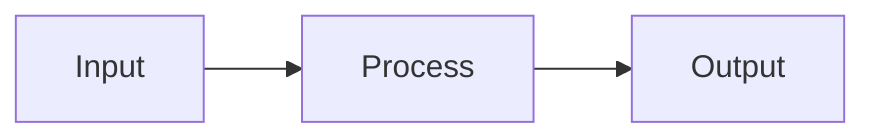

# Documentation

Comprehensive documentation for the AI Governance repository.

## Overview

This directory contains all project documentation including getting started guides, architecture decisions, how-to guides, and API references.

## Documentation Structure

```
docs/
├── getting-started/    # Onboarding and setup guides
├── architecture/       # Architecture decisions and design docs
├── guides/             # Task-oriented how-to guides
└── api/                # Auto-generated API documentation
```

## Quick Links

- [Getting Started](getting-started/) - New to this project? Start here
- [Architecture](architecture/) - Understand the system design
- [Guides](guides/) - Learn how to accomplish specific tasks
- [API Reference](api/) - Detailed API documentation

## Documentation Types

### Getting Started
*Location: `getting-started/`*

Onboarding materials for new users and contributors:
- Installation and setup
- Basic concepts and terminology
- First examples and tutorials
- Common pitfalls and troubleshooting

### Architecture
*Location: `architecture/`*

System design and architectural decisions:
- Architecture Decision Records (ADRs)
- System diagrams and flows
- Technology choices and rationale
- Design patterns and principles

### How-To Guides
*Location: `guides/`*

Task-oriented guides for specific scenarios:
- Setting up governance pipelines
- Integrating with existing ML workflows
- Configuring compliance checks
- Deploying applications
- Creating custom agents

### API Reference
*Location: `api/`*

Auto-generated API documentation:
- Tool APIs
- Application APIs
- Agent interfaces
- Shared utilities

## Writing Documentation

### Documentation Principles

1. **User-Focused**: Write for your audience
2. **Clear and Concise**: Get to the point quickly
3. **Actionable**: Provide concrete steps
4. **Up-to-Date**: Keep docs synchronized with code
5. **Searchable**: Use clear headings and keywords

### Document Structure

#### Getting Started Guide Template
```markdown
# [Guide Title]

## What You'll Learn
Brief overview of what this guide covers.

## Prerequisites
- Requirement 1
- Requirement 2

## Step 1: [First Step]
Detailed instructions...

## Step 2: [Second Step]
More instructions...

## Next Steps
- Link to related guides
- Link to advanced topics

## Troubleshooting
Common issues and solutions.
```

#### Architecture Decision Record Template
```markdown
# ADR-001: [Decision Title]

**Status**: Accepted | Proposed | Deprecated
**Date**: 2024-01-15
**Deciders**: @username1, @username2

## Context
What is the issue we're facing?

## Decision
What decision did we make?

## Rationale
Why did we choose this option?

## Consequences
What are the implications of this decision?

### Positive
- Benefit 1
- Benefit 2

### Negative
- Trade-off 1
- Trade-off 2

## Alternatives Considered
What other options did we evaluate?

### Option A
Pros and cons...

### Option B
Pros and cons...

## References
- Link to discussions
- Related ADRs
- External resources
```

#### How-To Guide Template
```markdown
# How to [Accomplish Task]

## Overview
Brief description of the task and when you'd need this.

## Prerequisites
- Required knowledge
- Required tools/setup

## Steps

### 1. [First Step Title]
```bash
# Code or commands
```

Explanation of what this does.

### 2. [Second Step Title]
Continue with clear steps...

## Verification
How to verify this worked correctly.

## Troubleshooting
Common issues:

### Issue: [Problem Description]
**Solution**: How to fix it.

## Related Guides
- [Related Guide 1](link)
- [Related Guide 2](link)
```

### Writing Style

**Do**:
- Use active voice: "Run the command" not "The command should be run"
- Use present tense: "The system validates" not "The system will validate"
- Use simple words: "use" not "utilize"
- Include code examples
- Show expected output
- Link to related docs

**Don't**:
- Assume knowledge
- Use jargon without explanation
- Write long paragraphs
- Forget error cases
- Leave TODOs in published docs

### Code Examples

Always include:
- Language identifier for syntax highlighting
- Comments explaining non-obvious parts
- Complete, runnable examples
- Expected output

```python
from ai_governance.tools import BiasDetector

# Initialize the detector with configuration
detector = BiasDetector(config_path="config.yaml")

# Analyze model for bias
results = detector.analyze(
    model=my_model,
    data=test_data,
    protected_attributes=["gender", "race"]
)

# Print summary
print(results.summary())
# Expected output:
# Bias Analysis Results
# ---------------------
# Gender: 0.85 (Pass)
# Race: 0.72 (Fail)
```

## Building Documentation

### Local Preview

We use MkDocs for documentation:

```bash
# Install MkDocs
pip install mkdocs mkdocs-material

# Preview locally
mkdocs serve

# Build static site
mkdocs build
```

### Generating API Docs

```bash
# Install documentation tools
pip install sphinx sphinx-autodoc

# Generate API docs
cd docs/api
sphinx-apidoc -o . ../../tools ../../apps

# Build HTML
make html
```

## Documentation Tools

### MkDocs Configuration

See `mkdocs.yml` in repository root for configuration.

Key features:
- Material theme
- Search functionality
- Code syntax highlighting
- Automatic navigation
- GitHub integration

### Diagrams

Use Mermaid for diagrams:

```markdown

```

### Screenshots

Store screenshots in `docs/images/`:

```markdown

```

## Documentation Workflow

### Creating New Documentation

1. **Identify the gap**: What's missing?
2. **Choose location**: Getting started, guide, or architecture?
3. **Write draft**: Follow templates
4. **Add examples**: Include code and outputs
5. **Review**: Self-review for clarity
6. **Get feedback**: Share with team
7. **Publish**: Merge and deploy

### Updating Documentation

1. **Find outdated docs**: Regular audits
2. **Update content**: Fix inaccuracies
3. **Test examples**: Ensure code still works
4. **Update metadata**: Dates, versions
5. **Publish updates**: Deploy changes

### Documentation Reviews

All documentation changes should be reviewed for:
- Technical accuracy
- Clarity and readability
- Completeness
- Working code examples
- Broken links
- Grammar and spelling

## Documentation Standards

### File Naming
- Use lowercase with hyphens: `getting-started.md`
- Be descriptive: `how-to-deploy-models.md`
- Use consistent prefixes: `adr-001-decision-name.md`

### Links
- Use relative links: `[Guide](../guides/my-guide.md)`
- Check links regularly
- Use descriptive link text: "See [deployment guide](deploy.md)" not "click [here](deploy.md)"

### Images
- Use descriptive names: `bias-detection-workflow.png`
- Include alt text: ``
- Keep images small (< 500KB)
- Use PNG for screenshots, SVG for diagrams

### Code Formatting
- Use syntax highlighting
- Keep examples short (< 50 lines)
- Break long examples into steps
- Include output/results

## Maintenance

### Regular Tasks
- **Monthly**: Review and update getting started guides
- **Quarterly**: Audit all documentation for accuracy
- **Per Release**: Update API docs, add release notes
- **As Needed**: Fix reported issues, add requested content

### Documentation Debt
Track documentation debt in issues:
- Missing documentation
- Outdated content
- Broken examples
- Poor explanations

## Contributing

### Documentation Contributions Welcome

Documentation improvements are highly valued:
- Fix typos or unclear explanations
- Add missing examples
- Improve organization
- Translate to other languages

See [CONTRIBUTING.md](../CONTRIBUTING.md) for the contribution process.

### Getting Help

- **Questions**: Open a discussion
- **Issues**: Report documentation bugs
- **Suggestions**: Propose improvements in issues

## Resources

### Documentation Tools
- [MkDocs](https://www.mkdocs.org/)
- [MkDocs Material Theme](https://squidfunk.github.io/mkdocs-material/)
- [Mermaid Diagrams](https://mermaid-js.github.io/)

### Writing Guides
- [Google Developer Documentation Style Guide](https://developers.google.com/style)
- [Microsoft Writing Style Guide](https://docs.microsoft.com/en-us/style-guide/)
- [The Documentation System](https://documentation.divio.com/)

## License

Documentation is licensed under the MIT License. See [LICENSE](../LICENSE) for details.
